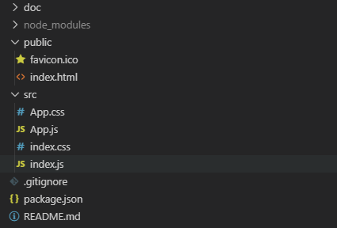
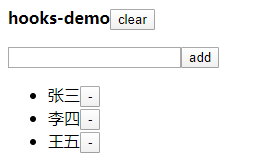
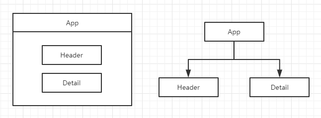

# hooks-demo

提供一个简单的使用hooks解决react组件间通信的demo

## 准备

### 环境准备

```
node v12.13.1
npm 6.12.1
create-react-app 3.3.0

// 可根据自己情况灵活选择
```

### 搭建结构

```bash
create-react-app hooks-demo
cd hooks-demo
npm run start
```
### 删除无用文件
最终目录结构如下：



## 搭建静态结构

### 目标功能


如上图所示：

- 点击`add`向列表中添加元素
- 点击`-`删除对应元素
- 点击`clear`清空列表

### 组件结构


可以发现，`Detail`组件展示列表的数据，将要被`App`、 `Detail`、 `Header`三个组件分别操作

主要代码如下：

```javascript
const App = () => {
  return (
    <section className="App">
      <div style={{ marginBottom: "15px" }}>
        <b>hooks-demo</b>
        <button>clear</button>
      </div>

      <Header />
      <Detail />
    </section>
  )
}

const Detail = () => {
  return (
    <section className="detail">
      <ul className="detail__list">
        <li className="detail__list-item">
          <span>张三</span>
          <button className="detail__list-item-del">-</button>
        </li>

        <li className="detail__list-item">
          <span>李四</span>
          <button className="detail__list-item-del">-</button>
        </li>

        <li className="detail__list-item">
          <span>王五</span>
          <button className="detail__list-item-del">-</button>
        </li>
      </ul>
    </section>
  )
}

const Header = () => {
	return (
		<section className="header">
			<input type="text" className="header__input" />
			<button className="header__confirm">add</button>
		</section>
	)
}
```

